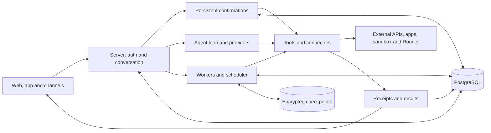

<!-- Logo goes here (light and dark versions in .github/images). -->

<h1 align="center">Brambit</h1>

<h3 align="center">The open-source engine for personal AI assistants anyone can use.</h3>

<p align="center">
  <a href="LICENSE"></a>
  <a href="https://github.com/morethanrealio/Brambit/actions/workflows/ci.yml"></a>
  <a href="https://github.com/morethanrealio/Brambit/tags"></a>
  
</p>

<p align="center"><a href="README.pt-BR.md">Leia em português</a></p>

Brambit gives every person their own AI assistants. They chat on the web, WhatsApp,
Telegram, email and Slack, remember what matters, use connectors (Google, Microsoft,
GitHub, MCP), run code in a sandbox, build and host small apps, and run scheduled
routines. You pick the model: any provider compatible with the OpenAI API, or
Gemini, with your own key.

Brambit is the core of [Brambs](https://brambs.com.br), a hosted service run by the
same team.

## Why Brambit

The big tech companies are launching personal assistants that act for you: they
remember you, use your apps, work in the background and talk to you where you
already are. Brambit gives you the same kinds of features in an environment you
control: it runs on your own server, with the model you choose, and the data is
stored with you. Only the context of each call goes to the model provider; with a local
model (Ollama, for example), not even that leaves your machine.

Open-source personal agents such as OpenClaw, NanoClaw and Hermes Agent are made for
developers: you set them up in a terminal and config files, and you are usually the
only person using them. Brambit is made for the people who will never open a terminal.

- *Built for people who don't code.* Whoever installs Brambit gives everyone else a
  web app: they sign in, a first-run guide sets up their assistant, and connectors link
  with a button. Nobody edits a config file to use it.
- *Many people, one install.* Each account is isolated from the others (the test suite
  carries isolation proofs), so a family, a team or a company can share one instance.
- *Asks before it acts.* Actions that write or send ask for confirmation first, and the
  confirmation is stored and checked again before anything happens. Code runs in a
  sandbox on a separate host; the Runner can run commands on the user's own machine
  with kernel-level confinement.
- *Where people already are.* One assistant answers on the web app, WhatsApp,
  Telegram, email and Slack, and can look back across its own channels.
- *Your model, your key.* Choose a provider and a model for each job (chat, images,
  research, coding, memory) in one commented YAML file, with an optional fallback.
- *Extensible without forking.* Plugins add branding, pages, screens, messages and
  answers to the questions the core asks the installer (spending limits, app and disk
  quotas, who pays for an account). Without plugins, every one of those has a working
  default.

## Quick start

Requirements: Node.js 24 (the CI version) on Linux or macOS. The database comes
with it (Postgres 14 from npm); nothing else to install.

```bash
npm ci
cp .env.example .env
cp modelos.example.yaml modelos.yaml   # pick providers and models (explained in the file)
# add to .env the key of each provider modelos.yaml uses
npm run modelos                        # checks: job → model, and warns about missing keys
npm run local
```

`npm run local` starts a throwaway database in `.local/` (on a local socket only),
applies the schema and migrations, creates a test account and starts the server.
When you see `[local] pronto: http://127.0.0.1:8080`, sign in with
`teste@example.com` / `brambs-local-teste`. To start over, stop it (Ctrl+C) and
delete `.local/`.

For the assistant to run code (Python, shell), start the sandbox in another
terminal: `ops/sandbox-host/local.sh` (Linux with Docker; asks for `sudo` for the
firewall). It prints the two `SANDBOX_*` lines for `.env`. Details in
[`ops/sandbox-host/README.md`](ops/sandbox-host/README.md).

## Providers and models

Brambit ships no model of its own. The choice lives in `modelos.yaml`, a commented
file with three sections:

- `provedores` (providers): a nickname, the API address and the *name* of the
  `.env` variable holding the key. Any OpenAI-compatible service works without code
  (Together, OpenAI, OpenRouter, Groq, DeepSeek, local Ollama...); Gemini uses
  `tipo: gemini`.
- `funcoes` (jobs): the model for each job (chat, images, research, coding, memory,
  classification...), with an optional `reserva` (fallback) model used if the main
  one fails. A job with no line inherits `padrao` (default), so one line is enough.
- `precos` (prices): the price of a new model, so spend is recorded correctly.

Without `modelos.yaml`, the built-in routing applies and one of these keys in `.env`
is enough:

| Provider | Variable | Text model used |
| --- | --- | --- |
| Together (recommended) | `TOGETHER_API_KEY` | DeepSeek V4.1 Flash |
| OpenAI | `OPENAI_API_KEY` | gpt-5.4-mini |
| Google Gemini | `GEMINI_API_KEY` | Gemini router (3.5 Flash / 3.1 Pro) |

Either way, image generation, text-to-speech and audio transcription use Gemini:
without `GEMINI_API_KEY` those three are off. Everything else (WhatsApp, Slack,
connectors, email) switches itself off while its settings in `.env` are empty; each
block is explained in [.env.example](.env.example).

## Architecture

The backend is a modular Node.js monolith: `web/server.mjs` brings HTTP, channels,
conversations and workers together in one service. PostgreSQL stores accounts,
conversations, proposals and execution records; private coding checkpoints and model
calls are also kept on an encrypted filesystem. User apps and the sandbox run on
separate hosts; the Runner can run on the user's own machine.



The entry point resolves owner, assistant and conversation and applies the
channel's controls. In the conversational wrapper, confirmations and deterministic
controls are handled before the model is called. Native tools that need confirmation
store the proposal; the human answer re-checks target and authorization before the
effect. This does not mean every external MCP tool is behind that gate yet.

The loop picks tools and calls providers with usage accounting. Coding jobs continue
in a durable worker, with checkpoints and kernel locks; reminders have one occurrence
per firing and per-part receipts on WhatsApp. A generated answer, an accepted action
and a confirmed delivery are different states.

Coding is designed for a single host; local locks are not a distributed queue. SQL
reservations protect confirmations, routines and occurrences, but they don't make the
whole service safe to run as multiple replicas.

### Plugins and ports

Whoever installs Brambit extends the engine with plugins (`web/plugins.mjs`) without
touching the core: branding (name, site, logo), pages, screens, the message catalog
and the *ports*, points where the core asks the installer something (how much a
person may spend, which app and disk limits apply, who pays for an account). Without
a plugin, each port has a default that keeps the whole instance working.

## Repository layout

- `web/`: the server (HTTP, channels, persistence, tools). Start with `server.mjs`,
  `db.mjs` (Postgres, schema `mtr_harness`) and `auth.mjs`.
- `core-proto/`: the model-agnostic agent loop (`core.mjs`), the common provider
  contract (`provider.mjs`) and the adapters in `providers/`.
- `onboarding/`, `routines/`, `discovery/`, `deepseek/`, `billing/`: TypeScript
  sources of subsystems; builds generate versioned runtime modules in `web/`.
- `migrations/`: SQL migrations; `npm run local` applies them in order.
- `runner-go/`: the Runner, which runs commands on the user's own machine with
  kernel-level confinement.
- `ops/sandbox-host/`: the code sandbox (dedicated machine or local mode).
- `ops/apps-host/`: control plane for hosted apps (`ctl.py`, `router.py`).
- `ops/tenancy-*.mjs`: account-isolation proofs, run by the test suite.
- `dev/`: `npm run local` and `npm run modelos`.
- `test-support/`: test suite helpers.

## Development and testing

To run it on your machine, use the [Quick start](#quick-start). Never reuse the
`.env` of a production instance for tests: boot applies the schema and starts the
configured integrations. `.env` is not versioned. Outside `npm run local`, the entry
point is `node web/server.mjs`, on `127.0.0.1:8090` by default.

Day to day, run only the tests for the area you changed (`node --test file.test.mjs`
or the area's script); `npm test` runs the whole suite. Browser tests need
Chromium/Chrome via `CHROMIUM_PATH` when required; coding storage tests need `flock`.
Database tests use the same embedded Postgres 14:

```bash
export TEST_POSTGRES_BIN="$(node --input-type=module -e "const m=await import('./dev/local.mjs');console.log(m.postgresBin())")"
node --test server-boot.test.mjs
```

That test creates its own database, isolates credentials and blocks outside access.
Don't assume the same protection for every eval script in the repository.

## Resources

- [Contributing guide](CONTRIBUTING.md) and [open work](TODO.md)
- [Changelog](CHANGELOG.md)
- [Security policy](SECURITY.md)
- [Governance](GOVERNANCE.md) and [maintainers](MAINTAINERS.md)
- [Code of conduct](CODE_OF_CONDUCT.md)

## License

The code is [AGPL-3.0](LICENSE). Names, logos and mascots are not covered by the
license (see [GOVERNANCE.md](GOVERNANCE.md#trademark)).
