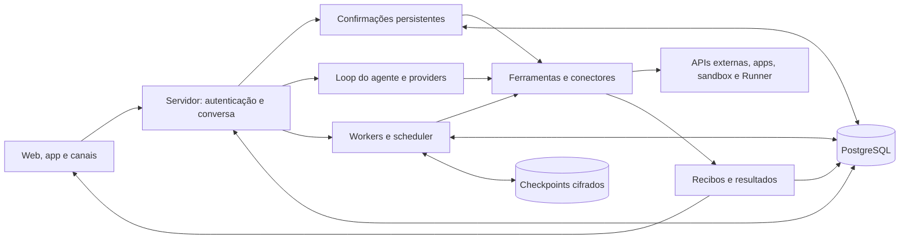

<!-- Logo vai aqui (versões clara e escura em .github/images). -->

<h1 align="center">Brambit</h1>

<h3 align="center">O motor open source de assistentes pessoais de IA que qualquer pessoa consegue usar.</h3>

<p align="center">
  <a href="LICENSE"></a>
  <a href="https://github.com/morethanrealio/Brambit/actions/workflows/ci.yml"></a>
  <a href="https://github.com/morethanrealio/Brambit/tags"></a>
  
</p>

<p align="center"><a href="README.md">Read in English</a></p>

O Brambit dá a cada pessoa assistentes de IA próprios. Eles conversam pela web,
WhatsApp, Telegram, e-mail e Slack, lembram do que importa, usam conectores
(Google, Microsoft, GitHub, MCP), rodam código num sandbox, criam e hospedam
pequenos apps e executam rotinas agendadas. O modelo é escolha de quem instala:
qualquer provedor compatível com a API da OpenAI, ou o Gemini, com a sua chave.

O Brambit é o núcleo do [Brambs](https://brambs.com.br), um serviço hospedado
mantido pelo mesmo time.

## Por que o Brambit

As big techs estão lançando assistentes pessoais que agem por você: lembram de
você, usam os seus apps, trabalham em segundo plano e conversam onde você já está.
O Brambit traz os mesmos tipos de funcionalidade num ambiente que você controla:
roda no seu próprio servidor, com o modelo que você escolher, e os dados ficam com
você.

Agentes pessoais open source como OpenClaw, NanoClaw e Hermes Agent são feitos para
desenvolvedores: você configura pelo terminal e por arquivos de configuração, e em
geral é a única pessoa que usa. O Brambit é feito para quem nunca vai abrir um
terminal.

- *Feito para quem não programa.* Quem instala o Brambit entrega a todo mundo um app
  web: a pessoa entra, um guia de primeiro acesso monta o assistente dela e os
  conectores se ligam com um botão. Ninguém edita arquivo de configuração para usar.
- *Muita gente, uma instalação.* Cada conta é isolada das outras (a suíte de testes
  traz provas de isolamento), então uma família, um time ou uma empresa podem
  dividir a mesma instância.
- *Pergunta antes de agir.* Ações que gravam ou enviam pedem confirmação antes, e a
  confirmação fica guardada e é conferida de novo antes do efeito. O código roda num
  sandbox em outra máquina; o Runner executa comandos na máquina do próprio usuário,
  com confinamento no kernel.
- *Onde as pessoas já estão.* O mesmo assistente responde no app web, WhatsApp,
  Telegram, e-mail e Slack, e consegue consultar o que foi dito nos outros canais.
- *Seu modelo, sua chave.* Escolha provedor e modelo por função (conversa, imagem,
  pesquisa, programação, memória) num único YAML comentado, com reserva opcional.
- *Extensível sem fork.* Plugins trazem marca, páginas, telas, mensagens e as
  respostas às perguntas que o núcleo faz a quem instala (limite de gasto, teto de
  apps e disco, quem paga uma conta). Sem plugin, cada uma tem um padrão que funciona.

## Quick start

Requisitos: Node.js 24 (a versão do CI) em Linux ou macOS. O banco vem junto
(Postgres 14 pelo npm); não precisa instalar mais nada.

```bash
npm ci
cp .env.example .env
cp modelos.example.yaml modelos.yaml   # escolha provedores e modelos (explicado no arquivo)
# cole no .env a chave de cada provedor que o modelos.yaml usa
npm run modelos                        # confere: função → modelo, e avisa chave faltando
npm run local
```

O `npm run local` sobe um banco descartável em `.local/` (só num socket local),
aplica schema e migrações, cria uma conta de teste e abre o servidor. Quando
aparecer `[local] pronto: http://127.0.0.1:8080`, entre com `teste@example.com` /
`brambs-local-teste`. Pra recomeçar do zero, pare (Ctrl+C) e apague `.local/`.

Pra o assistente rodar código (python, shell), suba o sandbox num outro
terminal: `ops/sandbox-host/local.sh` (Linux com Docker; pede `sudo` pro
firewall). Ele imprime as duas linhas `SANDBOX_*` pro `.env`. Detalhe em
[`ops/sandbox-host/README.md`](ops/sandbox-host/README.md).

## Provedores e modelos

O Brambit não traz modelo próprio. A escolha fica no `modelos.yaml`, um arquivo comentado com três seções:

- `provedores`: apelido, endereço da API e o *nome* da variável do `.env` com a
  chave. Qualquer serviço compatível com a API da OpenAI entra sem código
  (Together, OpenAI, OpenRouter, Groq, DeepSeek, Ollama local...); o Gemini entra
  com `tipo: gemini`.
- `funcoes`: o modelo de cada função (conversa, imagem, pesquisa, programação,
  memória, classificação...), com um modelo `reserva` opcional que entra se o
  principal cair. Função sem linha herda do `padrao`, então uma linha basta.
- `precos`: preço de modelo novo, pra o registro de gasto sair certo.

Sem `modelos.yaml`, vale o roteamento embutido, e basta uma destas chaves no `.env`:

| Provedor | Variável | Modelo de texto usado |
| --- | --- | --- |
| Together (recomendado) | `TOGETHER_API_KEY` | DeepSeek V4.1 Flash |
| OpenAI | `OPENAI_API_KEY` | gpt-5.4-mini |
| Google Gemini | `GEMINI_API_KEY` | roteador do Gemini (3.5 Flash / 3.1 Pro) |

Nos dois caminhos, gerar imagem, falar em voz e transcrever áudio usam o Gemini:
sem `GEMINI_API_KEY` esses três ficam desligados. O resto (WhatsApp, Slack,
conectores, e-mail) desliga sozinho enquanto a configuração dele estiver vazia
no `.env`; cada bloco está explicado no [.env.example](.env.example).

## Arquitetura

O backend é um monólito Node.js modular: `web/server.mjs` integra HTTP, canais,
conversas e workers no mesmo serviço. PostgreSQL guarda contas, conversas,
propostas e registros de execução; checkpoints privados de programação e chamadas
de modelo também ficam em filesystem cifrado. Os apps dos usuários e o sandbox
executam em hosts separados; o Runner pode executar na máquina do próprio usuário.



A entrada resolve dono/assistente/conversa e aplica os controles do canal. No
wrapper conversacional, confirmações e controles determinísticos são tratados
antes de chamar o modelo. Ferramentas nativas sujeitas a confirmação persistem a
proposta; a resposta humana revalida alvo e autorização antes do efeito. Isso não
significa que toda ferramenta externa MCP já esteja protegida por esse gate.

O loop escolhe ferramentas e chama providers com contabilização de uso. Trabalhos
de programação continuam em worker durável, com checkpoints e locks de kernel;
lembretes têm uma ocorrência por disparo e recibos por parte no WhatsApp. Uma
resposta gerada, uma ação aceita e uma entrega confirmada são estados diferentes.

O desenho de programação é de um único host; locks locais não são uma fila
distribuída. Reservas SQL protegem confirmações, rotinas e ocorrências, mas não
tornam todo o serviço apto a múltiplas réplicas.

### Plugins e portas

Quem instala o Brambit estende o motor por plugins (`web/plugins.mjs`), sem mexer
no núcleo: marca (nome, site, logo), páginas, telas, catálogo de mensagens e as
*portas*, pontos onde o núcleo pergunta algo a quem instalou (quanto a pessoa
pode gastar, que limites de apps e disco valem, quem paga uma conta). Sem plugin,
cada porta tem um padrão que deixa a instância inteira funcionando.

## Estrutura do repositório

- `web/`: servidor (HTTP, canais, persistência, ferramentas). Começar por
  `server.mjs`, `db.mjs` (Postgres, schema `mtr_harness`) e `auth.mjs`.
- `core-proto/`: loop de agente model-agnostic (`core.mjs`), contrato comum de
  provider (`provider.mjs`) e os adapters em `providers/`.
- `onboarding/`, `routines/`, `discovery/`, `deepseek/`, `billing/`: fontes
  TypeScript de subsistemas; os builds geram módulos runtime versionados em `web/`.
- `migrations/`: SQL de migração; o `npm run local` aplica em ordem.
- `runner-go/`: o Runner, que executa comandos na máquina do próprio usuário, com
  confinamento no kernel.
- `ops/sandbox-host/`: sandbox de código (máquina dedicada ou modo local).
- `ops/apps-host/`: plano de controle dos apps hospedados (`ctl.py`, `router.py`).
- `ops/tenancy-*.mjs`: provas de isolamento entre contas, rodadas pela suíte.
- `dev/`: `npm run local` e `npm run modelos`.
- `test-support/`: apoio da suíte de testes.

## Desenvolvimento e validação

Pra rodar na sua máquina, use o [Quick start](#quick-start). Nunca reutilize o
`.env` de uma instância em produção para testes: o boot aplica schema e inicia
as integrações configuradas. O `.env` não é versionado. Fora do `npm run local`,
o entrypoint é `node web/server.mjs`, por padrão em `127.0.0.1:8090`.

Na rotina, rode só os testes da área que mudou (`node --test arquivo.test.mjs` ou
o script da área); `npm test` roda a suíte inteira. Testes de navegador exigem
Chromium/Chrome via `CHROMIUM_PATH` quando necessário; testes de armazenamento de
programação precisam de `flock`. Os testes com banco usam o mesmo Postgres 14
embutido:

```bash
export TEST_POSTGRES_BIN="$(node --input-type=module -e "const m=await import('./dev/local.mjs');console.log(m.postgresBin())")"
node --test server-boot.test.mjs
```

Esse teste cria seu próprio banco, isola credenciais e bloqueia acessos externos.
Essa proteção não deve ser presumida para qualquer script de eval do repositório.

## Recursos

- [Guia de contribuição](CONTRIBUTING.md) e [trabalho em aberto](TODO.md)
- [Changelog](CHANGELOG.md)
- [Política de segurança](SECURITY.md)
- [Governança](GOVERNANCE.md) e [mantenedores](MAINTAINERS.md)
- [Código de conduta](CODE_OF_CONDUCT.md)

Os documentos da comunidade estão em inglês.

## Licença

O código é [AGPL-3.0](LICENSE). Nomes, logos e mascotes ficam fora da licença
(ver [GOVERNANCE.md](GOVERNANCE.md#trademark)).
